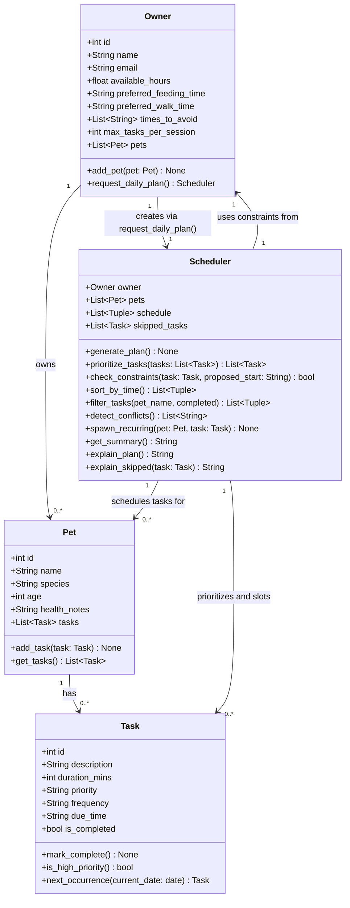

# PawPal+ Project Reflection

## 1. System Design

**a. Initial design**

I included the following classes:

1. PetOwner

- represents the user of the system
- Its responsibility is to store the owner’s basic information, available time, and preferences - also acts as the main person requesting the daily plan

2. OwnerPreference

- this class stores the owner’s personal preferences, such as preferred feeding or walking times, times to avoid, etc
- It helps the system create a plan that fits the owner’s lifestyle

3. Pet

- this class represents each pet in the household
- it stores pet-specific information such as name, species, age, and health notes. 
- different pets may need different care routines

4. PetCareTask

- this class represents a care activity such as feeding, walking, medication, grooming, etc
- it stores task details like duration, priority, frequency, due time, and completion status.

5. Constraint

- this class represents scheduling rules or limitations
- it models things like time available, required deadlines, medication timing, etc
- the planner checks these constraints before creating the daily plan.

6. DailyPlan

- this class represents the final plan for one day.
- its responsibility is to hold the list of scheduled tasks and track the total time used.

7. ScheduledTask

- This class connects a task to a specific time slot in the daily plan.
- Its responsibility is to show when a task starts and ends, and whether it is pending or completed.

8. Planner

- This is the main decision-making class
- it generates the daily plan by prioritizing tasks, checking constraints, and selecting the best schedule for the owner.

9. ExplanationEngine

This class explains the reasoning behind the generated plan.
Its responsibility is to describe why certain tasks were chosen first, why some were delayed, and how the owner’s preferences and constraints affected the final schedule.

⸻

**b. Design changes**

After reviewing the skeleton, four issues were identified and fixed:

1. Added 'pet' field to 'ScheduledTask'
   The original 'ScheduledTask' only held a 'PetCareTask', with no reference to which 'Pet' the slot belonged to. To display the plan clearly (e.g. "Walk Buddy at 07:00") the scheduled slot must know its pet directly, without having to search every pet's task list.

2. Added 'skipped_tasks' to 'Planner' and 'ExplanationEngine'
   'ExplanationEngine.explain_delay()' is supposed to explain why a task was skipped — but skipped tasks never appear in the 'DailyPlan'. 
   - The 'Planner' now tracks 'skipped_tasks: List[PetCareTask]' during scheduling and passes that list to 'ExplanationEngine', giving it the data it needs to explain omissions.

3. Renamed 'Planner.constraints' → 'global_constraints' and added a distinction
   Both 'Planner' and 'PetCareTask' had a 'constraints' field with no clear separation of responsibility. Renamed the planner's field to 'global_constraints' (owner-level rules that apply to the whole day, e.g. "unavailable 12:00–13:00") to distinguish it from task-level constraints (e.g. "medication must be given between 08:00–09:00"). Updated 'check_constraints()' doc to reflect that it checks both sources.

4. Clarified 'PetOwner.request_daily_plan()' relationship to 'Planner'
   The original docstring said "trigger the Planner" but 'PetOwner' held no reference to one. Clarified in the docstring that this method is responsible for instantiating a 'Planner(self)' and returning its result, making the ownership of that relationship explicit.

5. Simplified from 9 classes down to 4: Task, Pet, Owner, Scheduler
   The original design spread responsibility across too many small classes, making the system harder to follow. The following merges were made:
   - 'PetCareTask' → renamed 'Task' (simpler name, same responsibility)
   - 'OwnerPreference' → merged into 'Owner' (preferences are direct fields; no reason to split them into a separate object when they always belong to one owner)
   - 'Constraint', 'DailyPlan', 'ScheduledTask', 'ExplanationEngine' → all merged into 'Scheduler' (these classes only existed to support scheduling logic; consolidating them into 'Scheduler' removes the coordination overhead and keeps all scheduling decisions in one place)
   The schedule is now stored as a list of '(Pet, Task, start_time, end_time)' tuples inside 'Scheduler', and explanation methods live on 'Scheduler' directly.

---

## 2. Scheduling Logic and Tradeoffs

**a. Constraints and priorities**

The scheduler considers three main groups of constraints: 
- time
- task importance
- owner preferences

The system checks how much time the owner has available in a day, how long each task takes, and whether a task has a preferred or required time window. For example, feeding or medication may need to happen at a specific time, while grooming or enrichment may be more flexible.

Priority constraints help the system decide what must be scheduled first. Some tasks are more urgent or essential than others. For example, medication and feeding are usually high priority because they directly affect the pet’s health, while enrichment or grooming may be medium or lower priority depending on the day. Priority helps the scheduler make good choices when there is not enough time to do everything.

Owner preference constraints make the plan realistic and user-friendly. The system considers preferred walk times, feeding times, times the owner wants to avoid, and how many tasks they are comfortable doing in one session. These preferences matter because a plan is only useful if the owner is likely to follow it.

I decided these constraints mattered most because they directly affect whether the daily plan is both safe for the pet and practical for the owner. 

The order of importance is usually:
	1.	Health and safety needs of the pet
	2.	Time limits and deadlines
	3.	Owner preferences and convenience

**b. Tradeoffs**

Tradeoff: Completing all tasks vs. respecting the owner’s available time

The scheduler may leave out or reschedule lower-priority tasks (like grooming or enrichment) in order to ensure that high-priority tasks (like feeding or medication) fit within the owner’s limited time for the day

- Why is that tradeoff reasonable for this scenario?

This tradeoff makes sense because the system’s primary goal is to ensure the pet’s health and safety, not just to maximize the number of completed tasks.
	•	High-priority tasks are non-negotiable
Feeding and medication directly impact the pet’s wellbeing, so they must be completed even if time is limited.
	•	Time is a real constraint
A plan that ignores the owner’s available time is unrealistic and likely won’t be followed at all.
	•	Lower-priority tasks are flexible
Tasks like grooming or enrichment can often be delayed or moved to another day without serious consequences.

**Additional algorithmic tradeoff (Phase 4):** Conflict detection uses exact time-slot matching rather than checking overlapping durations.

The `detect_conflicts()` method flags two tasks as conflicting only if their `[start, end)` intervals literally overlap in the schedule string. This catches hard clashes (e.g. "08:00–08:30" vs "08:10–08:30") but will miss soft overruns — for example, if a task runs longer than expected and bleeds into the next slot. Exact matching was chosen because it is simple to reason about and avoids false positives from estimated durations. A future improvement could track actual elapsed time and re-check the schedule dynamically.

---

## 3. AI Collaboration

**a. How you used AI**

- Design brainstorming, Reviewing UML and skeleon, Debugging, Building the App
- "Refer to the reflection.md file to understand the structure of the app and build accordingly, do not add extra stuff, stick to the guidelines"
- 

**b. Judgment and verification**

One moment where I did not accept an AI suggestion as-is was during the conflict detection implementation. The AI initially suggested checking conflicts by comparing only the start times of tasks (flagging any two tasks that started within the same minute). I recognized this would produce false positives for tasks that start close together but don't actually overlap, and would miss genuine overlaps where one task ends after the next one starts. I evaluated the suggestion by drawing out a few example time windows on paper, then replaced it with the standard interval-overlap condition `start_a < end_b and start_b < end_a`, which correctly handles all overlap cases. I verified the fix by manually injecting an overlapping entry in `main.py` and confirming a conflict was reported, and by running the sequential no-conflict test to confirm it produced zero warnings.

---

## 4. Testing and Verification

**a. What you tested**

Seven behaviors were tested across two phases:

1. `mark_complete()` — ensures task completion status flips correctly; important because the UI and recurring logic depend on this flag.
2. `add_task()` — verifies that adding a task increases the pet's task count; important as the foundation for every other feature.
3. `sort_by_time()` — confirms the schedule is returned in HH:MM chronological order; important for the UI to display tasks in a readable sequence.
4. `spawn_recurring()` — checks that a daily task is marked complete and a new task is added with tomorrow's date; important because recurring logic is easy to get wrong with date arithmetic.
5. `detect_conflicts()` with overlapping entries — verifies that a manually injected clash produces at least one CONFLICT warning; important because the generate_plan method avoids conflicts by design, so the only way to test detection is injection.
6. `detect_conflicts()` with sequential tasks — confirms back-to-back tasks produce zero warnings; guards against false positives.
7. Empty pet schedule — ensures a pet with no tasks generates an empty schedule without crashing; important for defensive robustness.

**b. Confidence**

Confidence level: ★★★★☆

The core scheduling behaviors (prioritization, recurrence, conflict detection, sorting, filtering, edge cases) all pass. The main untested area is `check_constraints()`, which currently returns `None` (a stub). If I had more time, I would test: (1) that tasks exceeding the owner's available hours are correctly skipped even when high priority, (2) that `times_to_avoid` slots are respected during scheduling, and (3) multi-pet scheduling where two pets share the same time window.

---

## 5. Reflection

**a. What went well**

The part I am most satisfied with is the simplification from 9 classes down to 4. The original design felt over-engineered — having separate `Constraint`, `DailyPlan`, `ScheduledTask`, and `ExplanationEngine` classes added a lot of coordination overhead without adding real value. Merging them all into `Scheduler` made the code easier to read, test, and extend. The tuple-based schedule `(Pet, Task, start_time, end_time)` turned out to be a clean and flexible data structure that worked well for sorting, filtering, and conflict detection without needing a separate class.

**b. What you would improve**

If I had another iteration, I would implement `check_constraints()` properly so that the `times_to_avoid` list and preferred time windows actually influence when tasks are placed in the schedule — right now they are stored but never used. I would also add a frequency input to the task form in the UI so users can mark tasks as daily or weekly, and wire `spawn_recurring()` to a "Mark done" button so the next occurrence is created automatically from the interface.

**c. Key takeaway**

The most important thing I learned is that AI is a powerful collaborator for generating structure quickly, but the human engineer has to stay in the lead on design decisions. When AI suggested splitting responsibilities into 9 classes, it was technically correct, but it was my judgment call to simplify down to 4. That decision made every subsequent phase easier. Being the "lead architect" means using AI to accelerate implementation while actively pushing back when a suggestion adds complexity that the problem doesn't actually require.
