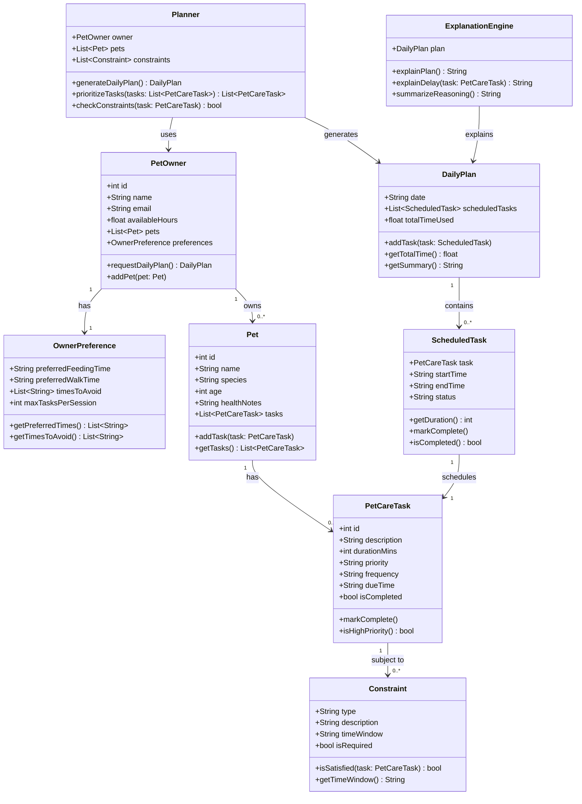

# PawPal+ Project Reflection

## 1. System Design

**a. Initial design**

I included the following classes:

1. PetOwner

- represents the user of the system
- Its responsibility is to store the owner’s basic information, available time, and preferences - also acts as the main person requesting the daily plan

2. OwnerPreference

- this class stores the owner’s personal preferences, such as preferred feeding or walking times, times to avoid, etc
- It helps the system create a plan that fits the owner’s lifestyle

3. Pet

- this class represents each pet in the household
- it stores pet-specific information such as name, species, age, and health notes. 
- different pets may need different care routines

4. PetCareTask

- this class represents a care activity such as feeding, walking, medication, grooming, etc
- it stores task details like duration, priority, frequency, due time, and completion status.

5. Constraint

- this class represents scheduling rules or limitations
- it models things like time available, required deadlines, medication timing, etc
- the planner checks these constraints before creating the daily plan.

6. DailyPlan

- this class represents the final plan for one day.
- its responsibility is to hold the list of scheduled tasks and track the total time used.

7. ScheduledTask

- This class connects a task to a specific time slot in the daily plan.
- Its responsibility is to show when a task starts and ends, and whether it is pending or completed.

8. Planner

- This is the main decision-making class
- it generates the daily plan by prioritizing tasks, checking constraints, and selecting the best schedule for the owner.

9. ExplanationEngine

This class explains the reasoning behind the generated plan.
Its responsibility is to describe why certain tasks were chosen first, why some were delayed, and how the owner’s preferences and constraints affected the final schedule.

⸻

**b. Design changes**

- Did your design change during implementation?
- If yes, describe at least one change and why you made it.

---

## 2. Scheduling Logic and Tradeoffs

**a. Constraints and priorities**

The scheduler considers three main groups of constraints: 
- time
- task importance
- owner preferences

The system checks how much time the owner has available in a day, how long each task takes, and whether a task has a preferred or required time window. For example, feeding or medication may need to happen at a specific time, while grooming or enrichment may be more flexible.

Priority constraints help the system decide what must be scheduled first. Some tasks are more urgent or essential than others. For example, medication and feeding are usually high priority because they directly affect the pet’s health, while enrichment or grooming may be medium or lower priority depending on the day. Priority helps the scheduler make good choices when there is not enough time to do everything.

Owner preference constraints make the plan realistic and user-friendly. The system considers preferred walk times, feeding times, times the owner wants to avoid, and how many tasks they are comfortable doing in one session. These preferences matter because a plan is only useful if the owner is likely to follow it.

I decided these constraints mattered most because they directly affect whether the daily plan is both safe for the pet and practical for the owner. 

The order of importance is usually:
	1.	Health and safety needs of the pet
	2.	Time limits and deadlines
	3.	Owner preferences and convenience

**b. Tradeoffs**

Tradeoff: Completing all tasks vs. respecting the owner’s available time

The scheduler may leave out or reschedule lower-priority tasks (like grooming or enrichment) in order to ensure that high-priority tasks (like feeding or medication) fit within the owner’s limited time for the day

- Why is that tradeoff reasonable for this scenario?

This tradeoff makes sense because the system’s primary goal is to ensure the pet’s health and safety, not just to maximize the number of completed tasks.
	•	High-priority tasks are non-negotiable
Feeding and medication directly impact the pet’s wellbeing, so they must be completed even if time is limited.
	•	Time is a real constraint
A plan that ignores the owner’s available time is unrealistic and likely won’t be followed at all.
	•	Lower-priority tasks are flexible
Tasks like grooming or enrichment can often be delayed or moved to another day without serious consequences.

---

## 3. AI Collaboration

**a. How you used AI**

- Design brainstorming, Debugging, Building the App
- "Refer to the reflection.md file to understand the structure of the app and build accordingly, do not add extra stuff, stick to the guidelines"

**b. Judgment and verification**

- Describe one moment where you did not accept an AI suggestion as-is.
- How did you evaluate or verify what the AI suggested?

---

## 4. Testing and Verification

**a. What you tested**

- What behaviors did you test?
- Why were these tests important?

**b. Confidence**

- How confident are you that your scheduler works correctly?
- What edge cases would you test next if you had more time?

---

## 5. Reflection

**a. What went well**

- What part of this project are you most satisfied with?

**b. What you would improve**

- If you had another iteration, what would you improve or redesign?

**c. Key takeaway**

- What is one important thing you learned about designing systems or working with AI on this project?
